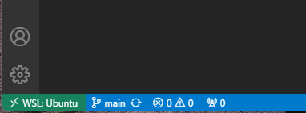

Reference to create VSCode (win) environment connected to WSL with added USB sharing.

**Table of Contents**

- [1. Install WSL distro](#1-install-wsl-distro)
- [2. Setup VS Code](#2-setup-vs-code)
  - [2.1. Install VS Code in Windows](#21-install-vs-code-in-windows)
  - [2.2. Install VS Code Remote Development extension pack](#22-install-vs-code-remote-development-extension-pack)
  - [2.3. Setup git in WSL](#23-setup-git-in-wsl)
- [3. Setup USB Sharing](#3-setup-usb-sharing)
  - [3.1. Install usbipd-win](#31-install-usbipd-win)
  - [3.2. Setup USB-IP in WSL](#32-setup-usb-ip-in-wsl)
  - [3.3. Add user to dialout group](#33-add-user-to-dialout-group)
  - [3.4. Share USB device with WSL](#34-share-usb-device-with-wsl)
- [4. Get Started](#4-get-started)
- [5. References](#5-references)


# 1. Install WSL distro
Assume WSL2 already installed.
```
> wsl.exe --install Ubuntu
```

# 2. Setup VS Code
## 2.1. Install VS Code in Windows

- [VS Code install page](https://code.visualstudio.com/download)

## 2.2. Install VS Code Remote Development extension pack

- [Remote Development extension pack](https://marketplace.visualstudio.com/items?itemName=ms-vscode-remote.vscode-remote-extensionpack)
  
This extension pack includes the WSL extension, enabling you to open any folder in WSL (from VS Code running in Windows).

Ref: [Get started using Visual Studio Code with Windows Subsystem for Linux](https://learn.microsoft.com/en-us/windows/wsl/tutorials/wsl-vscode)

## 2.3. Setup git in WSL

```
$ git config --global user.name "tneish"

$ git config --global credential.helper "/mnt/c/Program\ Files/Git/mingw64/bin/git-credential
-manager.exe"

```

# 3. Setup USB Sharing
## 3.1. Install usbipd-win
To share USB devices with WSL, both Windows and WSL need changes.

In Windows, install [usbipd-win](https://github.com/dorssel/usbipd-win/releases).

## 3.2. Setup USB-IP in WSL

Within WSL, install the user space tools for USB/IP and a database of USB hardware identifiers. See [WSL-setup](https://github.com/dorssel/usbipd-win/wiki/WSL-support#wsl-setup).


## 3.3. Add user to dialout group

(For USB serial device) To avoid running as root when accessing in WSL.

```
$ sudo usermod -a -G dialout $USER
```
Login again.

## 3.4. Share USB device with WSL
Start wsl to keep VM active
```
> wsl.exe -d Ubuntu
```

In a separate command window (as Administrator)..

```
>usbipd wsl list
BUSID  VID:PID    DEVICE                                                        STATE
2-4    10c4:ea60  CP2104 USB to UART Bridge Controller


>usbipd wsl attach --busid 2-4
usbipd: info: Using default WSL distribution 'Ubuntu'; specify the '--distribution' option to select a different one.
```

Should be visible in WSL now.

```
$ lsusb | grep CP210
Bus 001 Device 002: ID 10c4:ea60 Silicon Labs CP210x UART Bridge
```

# 4. Get Started

1. Open VS Code.
2. Connect to WSL.
   > CTRL-Shift-P 
   
   .. for command palette. Type/choose 
   > "Connect to WSL"
3. Leftmost icon in status field indicates WSL is connected (see below)




# 5. References

- [Setup WSL](https://learn.microsoft.com/en-us/windows/wsl/setup/environment)
- [Connecting USB devices to WSL](https://devblogs.microsoft.com/commandline/connecting-usb-devices-to-wsl/)
- [usbipd-win project on Github](https://github.com/dorssel/usbipd-win)
- [usbipd-win WSL support wiki](https://github.com/dorssel/usbipd-win/wiki/WSL-support)

